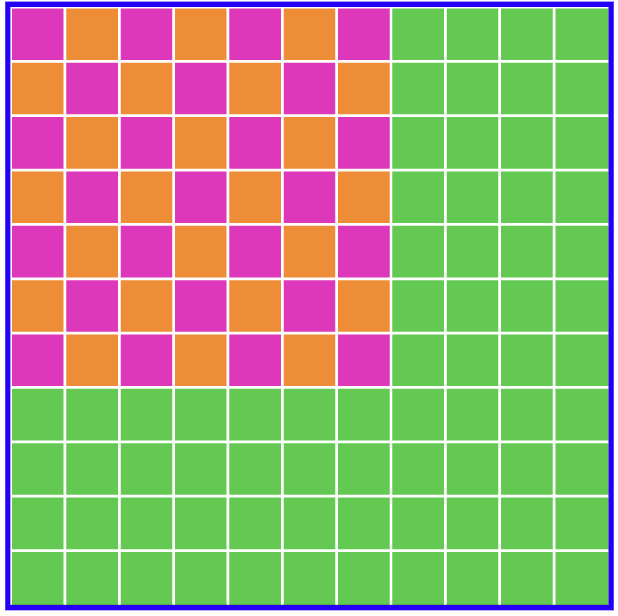
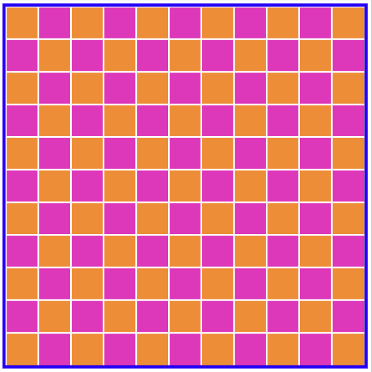

# arc-hy
Hy library for solving arc tasks.
```hy
(-> (new-grid [10 15])
    (draw (jnp.array [2 3]) (color-in Color.RED (reapply jnp.rot90 (pyramid-mask 3) 3)))
    (draw (jnp.array [4 3]) (color-in Color.BLUE (point-mask)))
    (color-background Color.BLACK))
```

Hy is a lisp dialect for Python.
By representing arc tasks with lisp you get an abstract representation that is easy to transform in high level ways.


For arc task `caa06a1f` we start with a texture on a green background.
```hy
(->
  (new-grid
    (.array jnp [11 11]))

  (draw
    (.array jnp [0 0])
    (apply-texture
      (.array jnp
        [[Color.PINK Color.ORANGE]
         [Color.ORANGE Color.PINK]])
      (rect-mask
        (.array jnp [7 7]))))

  (color-background Color.GREEN))
```


We can transform this into a grid with an expanded texture like so:
```python
def to_output(expr: hy.models.Expression) -> hy.models.Expression:
    grid_shape = hy_eval(expr[1][1])
    texture = hy_eval(code[2][2][1])
    return nested_list_as_hy_expr(
        ["->",
            ["new-grid", grid_shape],

            ["draw",
                [".array", "jnp", [0, 0]],
                ["apply-texture",
                    jnp.roll(texture, -1)
                    ["rect-mask" grid_shape]]]]
    )
```


You can find more examples of this in `seeds/`.

LLMs are currently using chain-of-thought prompting to solve Arc tasks where the model searches for a plausible step by step solution to an arc tasks.
An alternative could be to build up an abstract representation of the task grids and then operate on those abstractions to learn the transformation rule!
